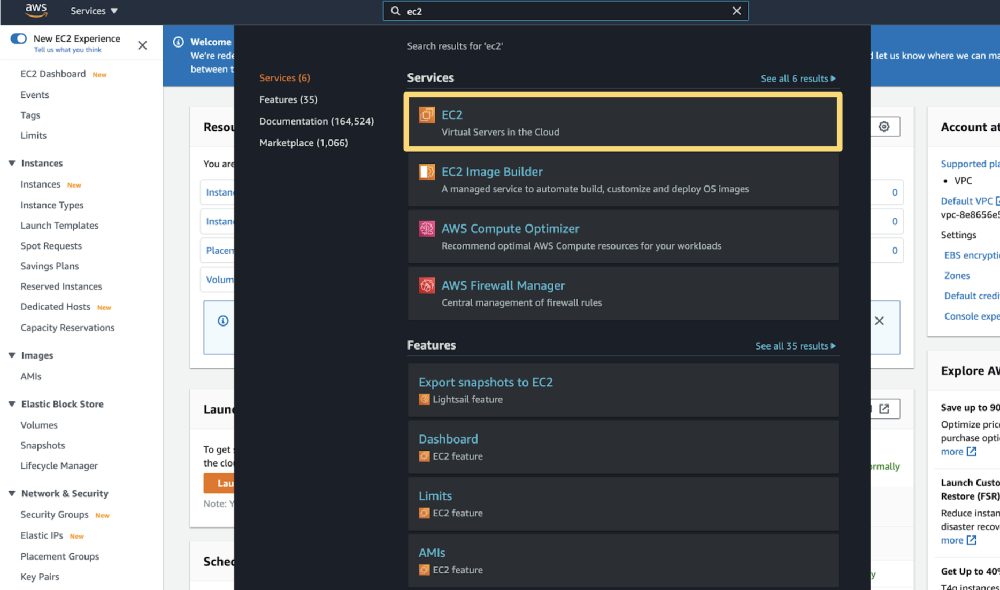
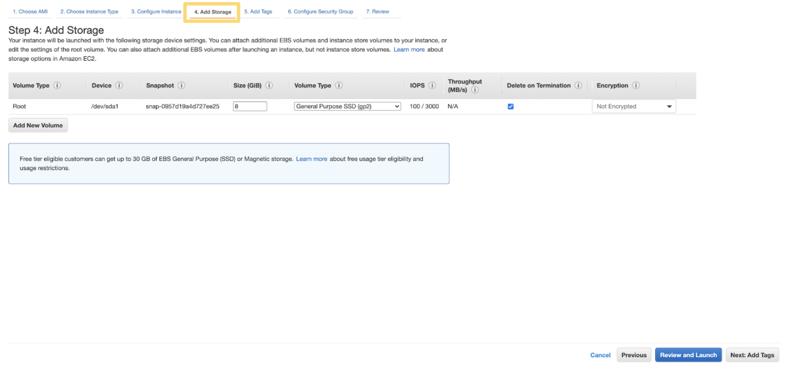
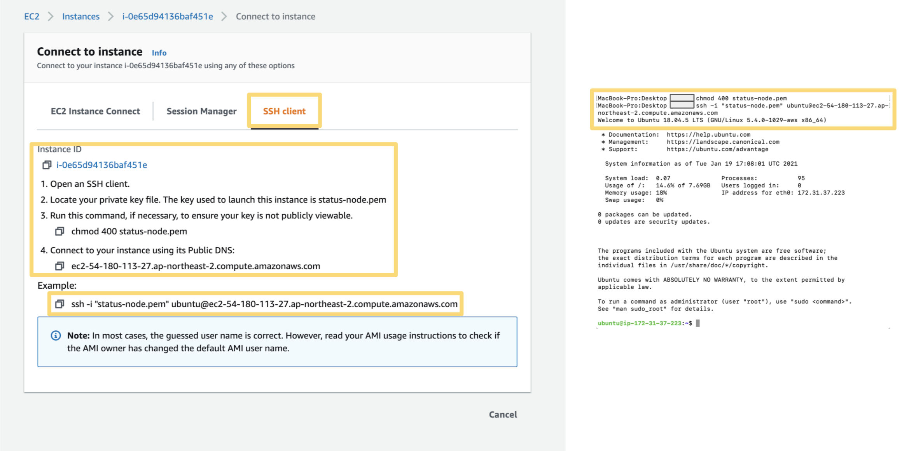

## Deploy an AWS EC2 instance

This guide will walk you through how to set up an Ubuntu machine to run a Status Node. Afterwards you can follow this [Step-by-Step guide](../status_node_step_by_step.html) to configure the Status Node.

### 1. Sign in to a cloud provider you prefer

 

### 2. Go to EC2

 

### 3. Click "Instances"

 

### 4. Click "Launch instances"

 

### 5. Create an Ubuntu instance (recommend 20.04)

 

### 6. Choose an instance type

- A single instance with 1GB of RAM and 1 vCPU should be enough to run Status Node reliably.

 

### 7. Add storage

- Status Node, also known as a history node or mailserver, requires additional disk space. Around 1 GB of free space would be a start for storing last <b>30 days</b>.

 

### 8. Open the 30303 port for TCP & UDP

- TCP: Add rule > Custom TCP rule > Port Range : 30303 > Source : Anywhere

- UDP: Add rule  > Custom UDP rule > Port Range : 30303 > Source : Anywhere

 

### 9. Key pair settings

- Key pair: a private key to access your machine.

- Don’t delete or lose the .pem file

 

### 10. Check the instance state

- Check if the instance is running

 

### 11. Connect to the instance 

#### Option 1: EC2 Instance connect

#### Option 2: SSH

1. Open your termnial

2. Move to the directory where you saved your key pair

3. Change key pair permission
  - Linux or Mac: `chmode 400 {pem-filename}`
  (e.g., chmod 400 status-node.pem)
  - Windows [Guide](https://superuser.com/questions/1296024/windows-ssh-permissions-for-private-key-are-too-open)

4. `ssh -i “{pem-filename}” ubuntu@{Public-DNS}`
(e.g., ssh -i "status-node.pem" ubuntu@ec2-12-345-678-901.ap-northeast-2.compute.amazonaws.com)

 

If you successfully deployed an EC2 instance, please follow this [Status Node Step-by-Step guide](../status_node_step_by_step.html) to configure a Status Node.