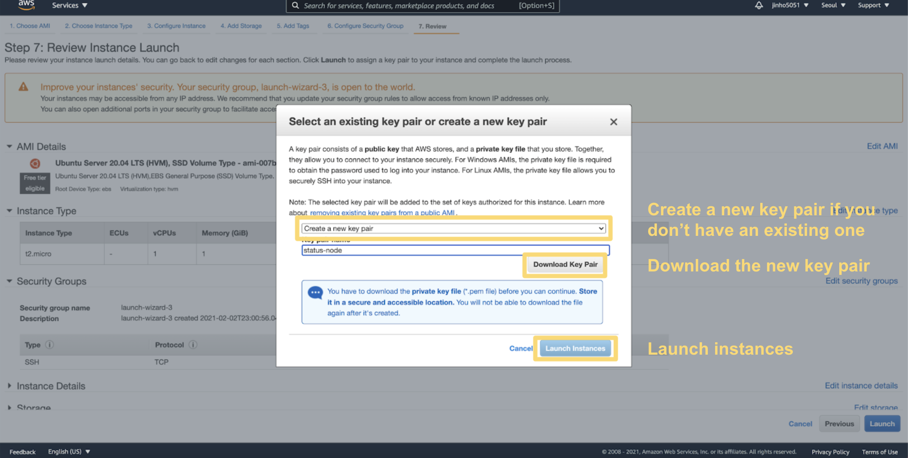
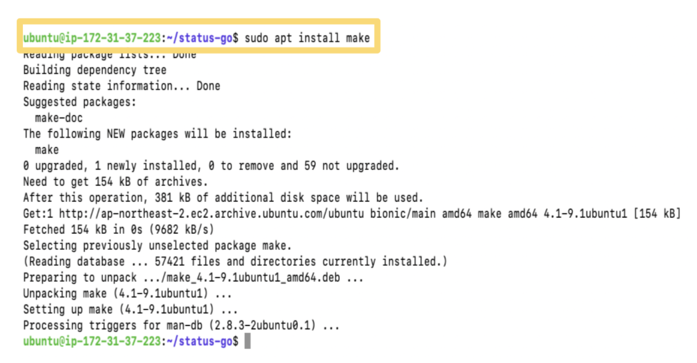

## Status Node QuickStart

You can run a Status Node in less than 30 minutes. What you have to do is to enter a couple of commands to run a docker image. 

This quickstart guide uses AWS to access a cloud computing service but any cloud providers supporting virtual machines are available. FYI, Status nodes don’t work on ARM architecture yet.

### 1. Sign in to a cloud provider you prefer

 

### 2. Go to EC2

 

### 3. Click "Instances"

 

### 4. Click "Launch instances"

 

### 5. Create an Ubuntu instance (recommend 20.04)

 

### 6. Choose an instance type

- A single instance with 1GB of RAM and 1 vCPU should be enough to run Status Node reliably.

 

### 7. Add storage

- Status Node, also known as a history node or mailserver, requires additional disk space. Around 1 GB of free space would be a start for storing last <b>30 days</b>.

 

### 8. Open the 30303 port for TCP & UDP

- TCP: Add rule > Custom TCP rule > Port Range : 30303 > Source : Anywhere

- UDP: Add rule  > Custom UDP rule > Port Range : 30303 > Source : Anywhere

 

### 9. Key pair settings

- Key pair: a private key to access your machine.

- Don’t delete or lose the .pem file

 

### 10. Check the instance state

- Click the "Connect" button if the instance is running

 

### 10. Check the instance state

- Click the "Connect" button if the instance is running

 

### 11. Connect to the instance 

#### Option 1: EC2 Instance connect

#### Option 2: SSH

1. Open your termnial

2. Move to the directory where you saved your key pair

3. Change key pair permission
  - Linux or Mac: `chmode 400 {pem-filename}`
  (e.g., chmod 400 status-node.pem)
  - Windows [Guide](https://superuser.com/questions/1296024/windows-ssh-permissions-for-private-key-are-too-open)

4. `ssh -i “{pem-filename}” ubuntu@{Public-DNS}`
(e.g., ssh -i "status-node.pem" ubuntu@ec2-12-345-678-901.ap-northeast-2.compute.amazonaws.com)

 

### 12. Install and enable docker

1. `sudo apt-get update`
2. `sudo apt install docker.io`
3. `sudo systemctl start docker`
4. `sudo systemctl enable docker`
5. `docker --version`
6. `sudo usermod -aG docker $USER`
7. `newgrp docker`

 

### 13. Install and enable docker-compose

1. `sudo curl -L "https://github.com/docker/compose/releases/download/1.26.2/docker-compose-$(uname -s)-$(uname -m)" -o /usr/local/bin/docker-compose`
2. `sudo chmod +x /usr/local/bin/docker-compose`
3. `docker-compose --version`

 

### 14. Install and enable docker-compose

1. `sudo curl -L "https://github.com/docker/compose/releases/download/1.26.2/docker-compose-$(uname -s)-$(uname -m)" -o /usr/local/bin/docker-compose`
2. `sudo chmod +x /usr/local/bin/docker-compose`
3. `docker-compose --version`

 

### 15. Install make

- `sudo apt install make`

 

### 16. Install jq

- `sudo apt-get install jq`

 

### 17. Clone Status-go

1. `git clone https://github.com/status-im/status-go.git`

2. `cd status-go/`

 

### 18. Run a Status Node

- `make run-mailserver-docker`

 

### 19. Health Check

1. `export DATA='{"jsonrpc":"2.0","method":"admin_peers","params":[],"id":1}'`
2. `curl -s -H 'content-type: application/json' -d $DATA localhost:8545 | jq .`

 

If there are peers connected,
`curl -s -H 'content-type: application/json' -d "$DATA" localhost:8545 | jq -r '.result[].network.remoteAddress'`
will return IP addresses

 

### 20. Check Waku envelopes

- `curl -s localhost:9090/metrics | grep '^waku_envelopes_received_total'`

 

## Troubleshooting

### Where is config.json?

- The config file is located at `/var/tmp/status-go-mail/`.

 

### How can I check the clusterConfig?

- Run `jq '.ClusterConfig.BootNodes' /var/tmp/status-go-mail/config.json`.

 

### How can I check the Status Node version?

- Run `docker ps` and check out the image name.

 

### How can update the docker image?

- Drop old docker container: `make clean-mailserver-docker`
- Clean up images: `docker image prune -f -a`
- Run again: `make run-mailserver-docker`

 

### How can check peer information?

- Run `curl -s localhost:9090/metrics | grep '^p2p_peers’`

 

### How can check peer information?

- Run `curl -s localhost:9090/metrics | grep '^p2p_peers’`

 

### No permissions to run 'docker'

Enable your user to properly use the docker commands without using sudo for every command.

1. `sudo usermod -aG docker $USER`
2. `newgrp docker`

 

### No 'docker-compose' in your $PATH. Please install it.

- Install [docker-compose](https://docs.docker.com/compose/)

1. `sudo curl -L "https://github.com/docker/compose/releases/download/1.26.2/docker-compose-$(uname -s)-$(uname -m)" -o /usr/local/bin/docker-compose`
2. `sudo chmod +x /usr/local/bin/docker-compose`
3. `docker-compose --version`

 

### No 'jq' in your $PATH. Please install it.

- Install [jq](https://stedolan.github.io/jq/) by running `sudo apt-get install jq`
