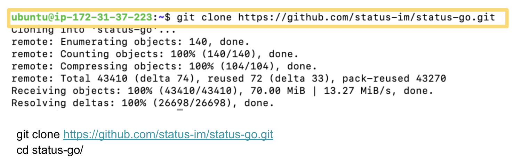
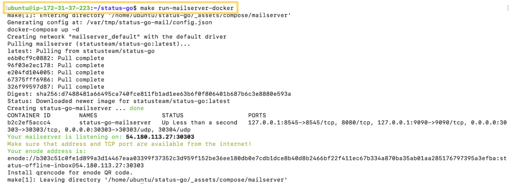
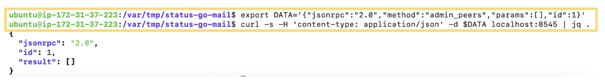

## Status Node Step-by-Step

You can run a Status Node in less than 30 minutes. What you have to do is to enter a couple of commands to run a docker image. 

If you have trouble deploying a Linux machine to run a docker iamge, you can find how to deploy an AWS EC2 cloud instance [here](./others/deploy_ec2_instance.html), or set your own with other cloud providers based on the guideline. This guide assumes you've correctly opened the TCP and UDP port 30303 on your device.

### 1. Install and enable docker

1. `sudo apt-get update`
2. `sudo apt install docker.io`
3. `sudo systemctl start docker`
4. `sudo systemctl enable docker`
5. `docker --version`
6. `sudo usermod -aG docker $USER`
7. `newgrp docker`

 

### 2. Install and enable docker-compose

1. `sudo curl -L "https://github.com/docker/compose/releases/download/1.26.2/docker-compose-$(uname -s)-$(uname -m)" -o /usr/local/bin/docker-compose`
2. `sudo chmod +x /usr/local/bin/docker-compose`
3. `docker-compose --version`

 

### 3. Install and enable docker-compose

1. `sudo curl -L "https://github.com/docker/compose/releases/download/1.26.2/docker-compose-$(uname -s)-$(uname -m)" -o /usr/local/bin/docker-compose`
2. `sudo chmod +x /usr/local/bin/docker-compose`
3. `docker-compose --version`

 

### 4. Install make

- `sudo apt install make`

 

### 5. Install jq

- `sudo apt-get install jq`

 

### 6. Clone Status-go

1. `git clone https://github.com/status-im/status-go.git`

2. `cd status-go/`

 

### 7. Run a Status Node

- `make run-mailserver-docker`

 

### 8. Health Check

1. `export DATA='{"jsonrpc":"2.0","method":"admin_peers","params":[],"id":1}'`
2. `curl -s -H 'content-type: application/json' -d $DATA localhost:8545 | jq .`

 

If there are peers connected,
`curl -s -H 'content-type: application/json' -d "$DATA" localhost:8545 | jq -r '.result[].network.remoteAddress'`
will return IP addresses

 

### 9. Check Waku envelopes

- `curl -s localhost:9090/metrics | grep '^waku_envelopes_received_total'`

 

## Troubleshooting

### Where is config.json?

- The config file is located at `/var/tmp/status-go-mail/`.

 

### How can I check the clusterConfig?

- Run `jq '.ClusterConfig.BootNodes' /var/tmp/status-go-mail/config.json`.

 

### How can I check the Status Node version?

- Run `docker ps` and check out the image name.

 

### How can update the docker image?

- Drop old docker container: `make clean-mailserver-docker`
- Clean up images: `docker image prune -f -a`
- Run again: `make run-mailserver-docker`

 

### How can check peer information?

- Run `curl -s localhost:9090/metrics | grep '^p2p_peers’`

 

### How can check peer information?

- Run `curl -s localhost:9090/metrics | grep '^p2p_peers’`

 

### No permissions to run 'docker'

Enable your user to properly use the docker commands without using sudo for every command.

1. `sudo usermod -aG docker $USER`
2. `newgrp docker`

 

### No 'docker-compose' in your $PATH. Please install it.

- Install [docker-compose](https://docs.docker.com/compose/)

1. `sudo curl -L "https://github.com/docker/compose/releases/download/1.26.2/docker-compose-$(uname -s)-$(uname -m)" -o /usr/local/bin/docker-compose`
2. `sudo chmod +x /usr/local/bin/docker-compose`
3. `docker-compose --version`

 

### No 'jq' in your $PATH. Please install it.

- Install [jq](https://stedolan.github.io/jq/) by running `sudo apt-get install jq`
